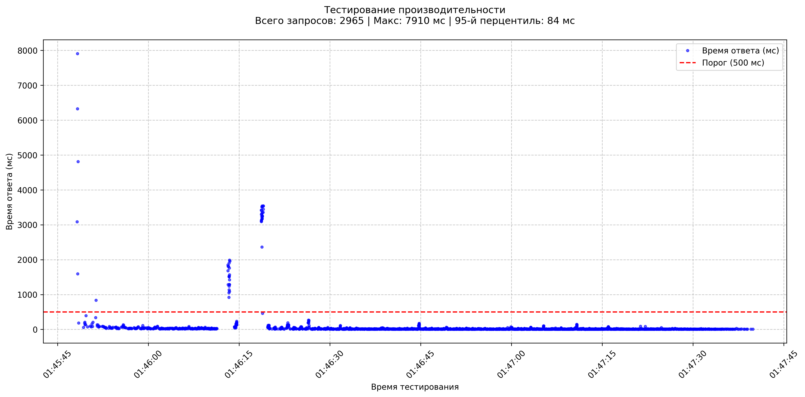
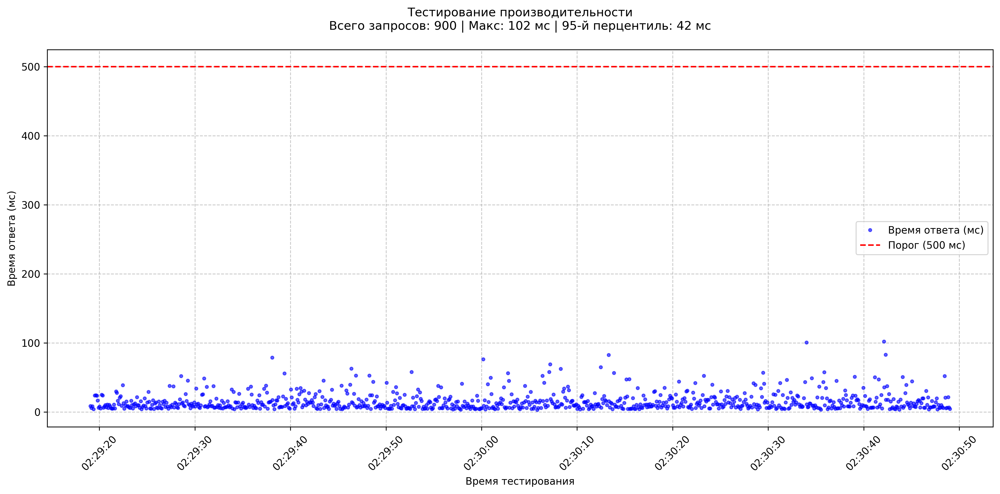
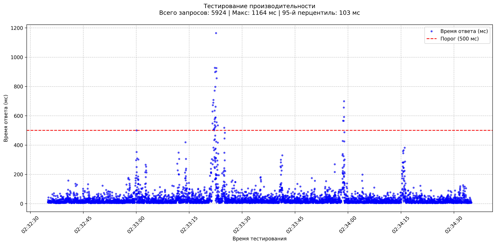

# Отчёт о нагрузочном тестировании

## Результаты нагрузочного тестирования

### 1. Базовый сценарий (50 VUs)
- Все эндпоинты соответствуют SLA
- Среднее время ответа: 13.48ms
- Максимальная нагрузка: 9.98 RPS
- 95-й перцентиль:
  - `/visitors`: 18.5ms
  - `/equipments`: 12.47ms
  - `/sessions`: 47.13ms
- 0 ошибок при 1198 запросах

### 2. Пиковая нагрузка (100 VUs)
- Система выдерживает без ошибок
- Среднее время ответа: 15.14ms
- 95-й перцентиль:
   - `/visitors`: 27.85ms
   - `/equipments`: 14.93ms
   - `/sessions`: 56.88ms
- 0 ошибок при 900 запросах
- Заметен рост времени ответа:
  - +50% для `/sessions`
  - +33% для `/visitors`

### 3. Длительная нагрузка (50 RPS)
- Зафиксировано 1 превышение timeout (1.16s)
- Среднее время ответа: 33.38ms
- 95-й перцентиль:
   - `/visitors`: 92.63ms
   - `/equipments`: 43.19ms
   - `/sessions`: 223.08ms
- `/sessions` приближается к лимиту (p95=223ms)

## Графики нагрузочного тестирования

### График времени ответа

📊 Дополнительные графики (нажмите для раскрытия)

### График времени ответа для базового запроса

### График времени ответа для пикового запроса

### График времени ответа для длинного запроса

## Анализ

### Улучшения по работе:
1. Оптимизировать эндпоинт `/sessions`
2. Добавить auto-scaling при RPS >40
3. Внедрить кэширование для GET-запросов
